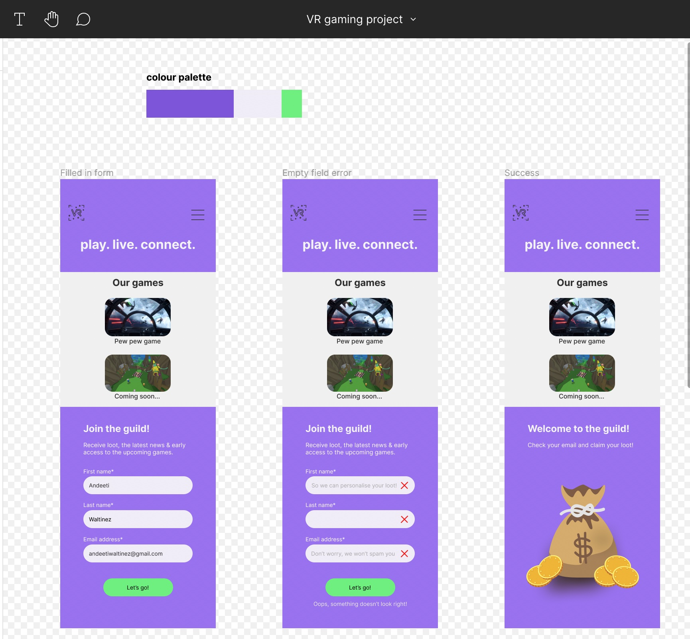
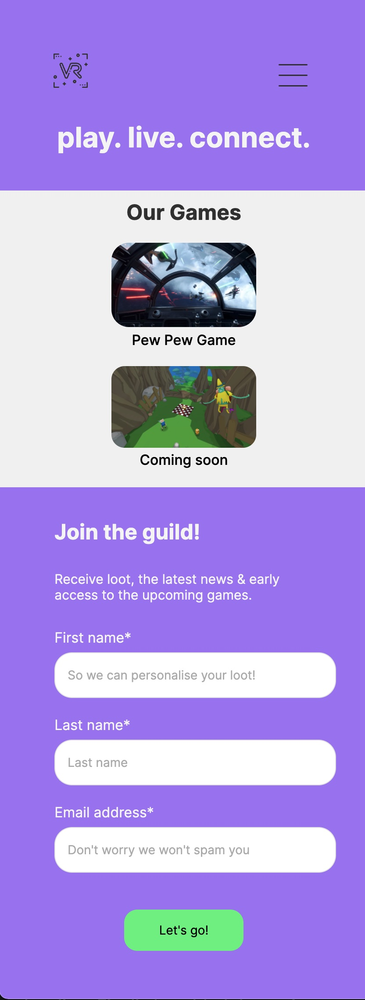
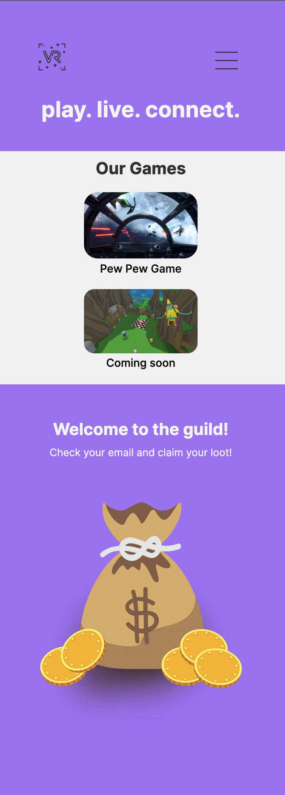
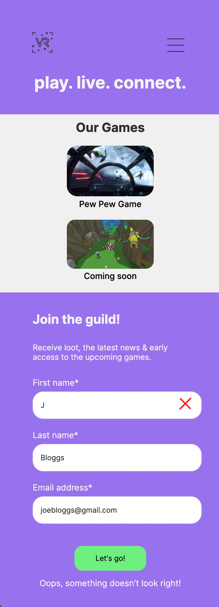

# VRGaming Newsletter Signup

A collaboration with GA UI/UX Immersive Students. This project was completed in 28 hours, working to this [brief.](https://docs.google.com/document/d/1IsF09FzYTUUK_uygoiZt9Jp0YqTsod8bEWKdvavTJdk/edit?usp=sharing) 

---------------------------------------------------------------

## Built with

* React
* Ruby on Rails [repo](https://github.com/edwalters99/vrgame-server)
* PostgreSQL

---------------------------------------------------------------
## Screenshots
Provided Figma Design:

<h3>Finished Product: </h3>

